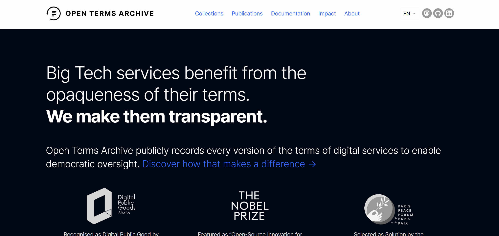

# Open Terms Archive Frontend (OTA)
**Led frontend development as Project Lead in a cross-functional team, delivering a user-focused solution for legal transparency.**

A user-focused frontend platform designed to improve **transparency in Terms of Service (ToS)** by making changes clear, accessible, and easy to understand.

---

## Project Context
This project was developed as part of an **Interdisciplinary Project at Hochschule Rhein-Waal**, in collaboration with the **Open Terms Archive (OTA)** initiative.

**The problem**  
Users often accept Terms of Service without understanding what has changed.

**Our solution**  
A platform that visually highlights **what changed, where it changed, and how it impacts users**.

---

## Key Features
- Side-by-side comparison of document versions  
- Color-coded highlights  
  - Green → Added content  
  - Red → Removed/modified content  
- Multilingual support (EN / DE / FR)  
- Clean, readable UI for legal documents  
- Responsive and user-friendly design  

---

## My Role (Project Lead – Frontend Team)
- Led my team through planning, execution, and delivery  
- Managed task distribution and sprint-based workflow  
- Coordinated with cross-functional teams (Psychology, Business, Backend)  
- Translated research insights into practical frontend solutions  
- Developed core functionality (document viewing system)  
- Conducted user experience evaluation and improvements  

---

## Skills Demonstrated
- Project Management (Agile / Sprint-based)
- Cross-functional Collaboration
- Stakeholder Communication
- Product Thinking & Problem Solving
- Frontend Development (React Ecosystem)
- UX-driven Development

---

## Live Project
https://opentermsarchive.org/en/

## GitHub Repository
https://github.com/aarijjan/Interdisciplinary-Project---Social-Responsibility---Open-Term-Archive

---

## Screenshots:
### Homepage

---

## Impact
- Simplifies complex legal documents  
- Improves user awareness of digital rights  
- Supports transparency in digital services  

---

## Acknowledgment
Developed under the supervision of **Prof. Matteo Große-Kampmann**  
In collaboration with interdisciplinary teams across departments.

---

# Technical Documentation

## Overview

This project contains the _OTA Frontend_ application and the project files for the _OTA Engine/Automation_. Instructions to access the Server running the _OTA Engine_ as well as a set up guide for the _OTA Frontend_ and the _OTA Automation_ are available below.

---

## Setting up the OTA Frontend

### Prerequisites

Ensure the following are installed on your system:

- _Node.js_ – You can download it from: [https://nodejs.org/en/download](https://nodejs.org/en/download)
- _npm_ (comes with Node.js)

Verify the installations by running the following commands in terminal:

    node -v
    npm -v

Expected versions:

- node -v → _v24.12.0_
- npm -v → _11.6.2_

---

### Setup Instructions

#### 1. Clone the Repository

    git clone https://gitlab.hsrw.eu/31627/ip-social-responsibility.git

#### 2. Navigate to the Frontend Folder

    cd ota_frontend

Make sure you are inside the ota_frontend directory before proceeding.

---

### Install Dependencies

Run the following command to install all required dependencies:

    npm install --legacy-peer-deps

> _Note:_ The --legacy-peer-deps flag is required to avoid dependency resolution issues.

---

### Run the Development Server

Start the development server with:

    npm run dev

The application will start in development mode. Open your browser and navigate to the URL shown in the terminal (commonly http://localhost:5173).

---

### Troubleshooting

- Ensure the correct Node.js and npm versions are installed.
- If you encounter dependency errors, delete node_modules and package-lock.json, then rerun:

  npm install --legacy-peer-deps

## Accessing the OTA-Engine

The server running the Engine is accesible under the ip: 194.164.48.65

The necessary username and password will be included in a file inside the submission archive.

After logging in the engine is located in ''/home/ota_service_account'' and can be inspected.

Current progress/results of the engine can be accessed in the repositories:

- [Versions](https://github.com/cloudresiliencelab/german-versions) - Storage for the resulting plaintext archival data
- [Declarations](https://github.com/cloudresiliencelab/german-declarations) - Working repository storing the declarations and repository-workflows
- [Snapshots](https://github.com/cloudresiliencelab/german-snapshots) - Fallback repository containing the full HTML of targeted services before text extraction

## Setting up the dev environment for OTA Automation

### Prerequisites

- _Python_ – Accessible here: [https://www.python.org/downloads/](https://www.python.org/downloads/)
- _pip_ (installed along with python)

To check if the necessary tools are installed, the following commands can be run inside the cli of your choice:

    python --version
    pip --version

### Setup

#### 1. Clone repository

> _Note:_ If the frontend was previously installed, this step can be skipped.

Otherwise 

    git clone https://gitlab.hsrw.eu/31627/ip-social-responsibility

can be run to clone the repository.

#### 2. Navigate to the Automation Folder

    cd ota_extension/automation

#### 3. Install Dependencies

Run the following command to install all required dependencies:

    pip install -r requirements.txt

#### 4. Configure Gemini API Key

In the folder ip-social-responsibility/ota_extension/automation/llm a ``.env`` file needs to be set up, containing the API key used to connect to the Gemini LLM Models

A suitable API key can be obtained via [The Google AI Studio](https://aistudio.google.com/app/api-keys)

Sample ``.env`` file:

    GEMINI_API_KEY=<API_KEY>

### Dev environment

The project files should now be executable by prefixing 'python' in front of the filename, e.g.:

    python webcrawler_tos.py

